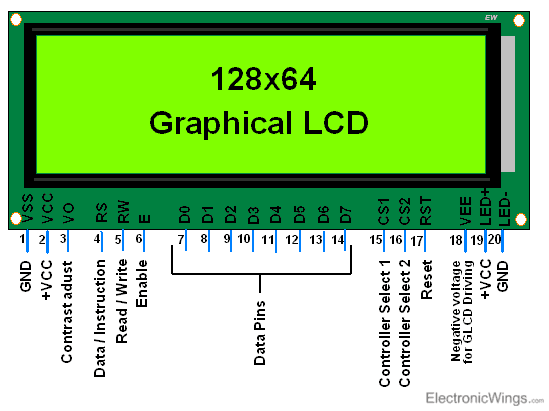
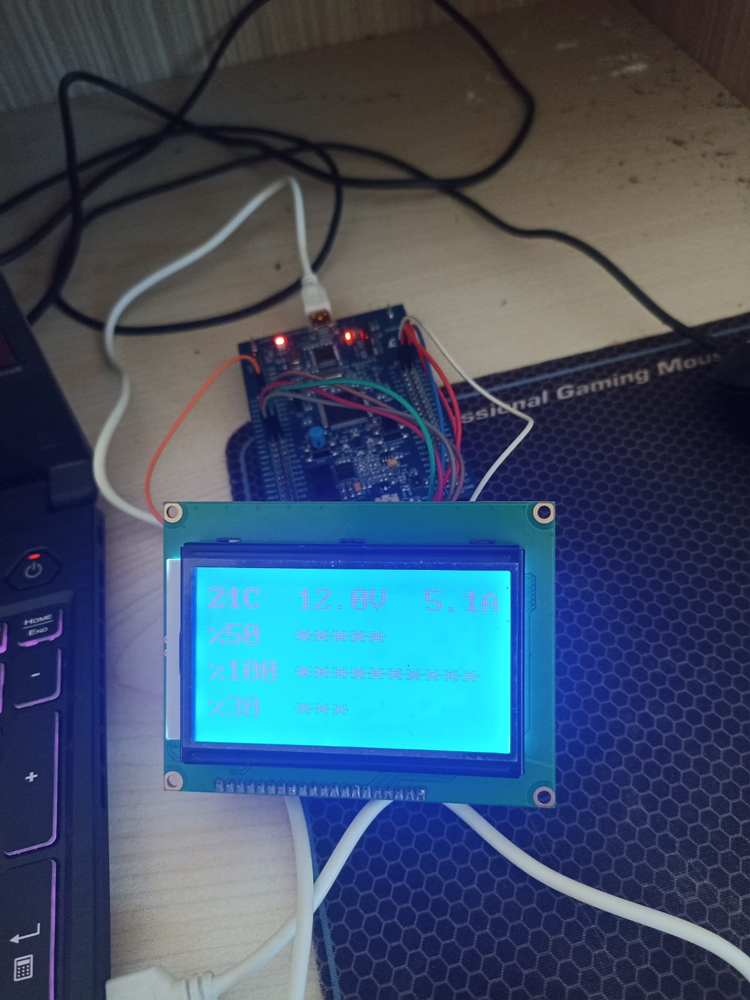
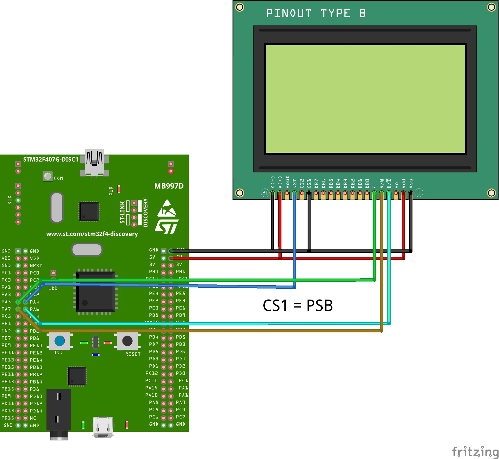

# STM32 128x64 GRAPHICS LCD
A project that provides writing with a 128x64 Graphic LCD using STM32

- ***Link headers***
  - [NOTE](#note)<br/>
  - [Main Code](#code-"main.c")<br/>
  - [Delay Code](#code-"delay.c")<br/>
  - [ST7920 Code](#code-"ST7920_SERIAL.c")<br/>

## NOTE
> [!NOTE]
> You need to set which TIM to use in the "delay.c" file

> [!NOTE]
> You need to set which pins to use in the "ST7920_SERIAL.c" file

## Pinout Diagram


## Connection Diagram


## Circuit


## Code "main.c"
```c++
/* USER CODE BEGIN Header */
/**
  ******************************************************************************
  * @file           : main.c
  * @brief          : Main program body
  ******************************************************************************
  * @attention
  *
  * Copyright (c) 2024 STMicroelectronics.
  * All rights reserved.
  *
  * This software is licensed under terms that can be found in the LICENSE file
  * in the root directory of this software component.
  * If no LICENSE file comes with this software, it is provided AS-IS.
  *
  ******************************************************************************
  */
/* USER CODE END Header */
/* Includes ------------------------------------------------------------------*/
#include "main.h"

/* Private includes ----------------------------------------------------------*/
/* USER CODE BEGIN Includes */


#include "ST7920_SERIAL.h"      //NOTE : You may need to change the pins.  Look the c file.
#include "delay.h"				//NOTE : You may need to change the timer. Look the c file.


/* USER CODE END Includes */

/* Private typedef -----------------------------------------------------------*/
/* USER CODE BEGIN PTD */

/* USER CODE END PTD */

/* Private define ------------------------------------------------------------*/
/* USER CODE BEGIN PD */

/* USER CODE END PD */

/* Private macro -------------------------------------------------------------*/
/* USER CODE BEGIN PM */

/* USER CODE END PM */

/* Private variables ---------------------------------------------------------*/
TIM_HandleTypeDef htim2;

/* USER CODE BEGIN PV */

/* USER CODE END PV */

/* Private function prototypes -----------------------------------------------*/
void SystemClock_Config(void);
static void MX_GPIO_Init(void);
static void MX_TIM2_Init(void);
/* USER CODE BEGIN PFP */

/* USER CODE END PFP */

/* Private user code ---------------------------------------------------------*/
/* USER CODE BEGIN 0 */

/* USER CODE END 0 */

/**
  * @brief  The application entry point.
  * @retval int
  */
int main(void)
{

  /* USER CODE BEGIN 1 */

  /* USER CODE END 1 */

  /* MCU Configuration--------------------------------------------------------*/

  /* Reset of all peripherals, Initializes the Flash interface and the Systick. */
  HAL_Init();

  /* USER CODE BEGIN Init */

  /* USER CODE END Init */

  /* Configure the system clock */
  SystemClock_Config();

  /* USER CODE BEGIN SysInit */

  /* USER CODE END SysInit */

  /* Initialize all configured peripherals */
  MX_GPIO_Init();
  MX_TIM2_Init();
  /* USER CODE BEGIN 2 */


  HAL_Delay(500);
  delay_init();
  ST7920_Init();

  ST7920_SendString(0, 0, "Semi Eren");
  ST7920_SendString(1, 0, "Semi Eren");
  ST7920_SendString(2, 0, "Semi Eren");
  ST7920_SendString(3, 0, "Semi Eren");
  HAL_Delay(3000);

  ST7920_Clear();


  /* USER CODE END 2 */

  /* Infinite loop */
  /* USER CODE BEGIN WHILE */
  uint8_t say=0;
  while (1)
  {
    /* USER CODE END WHILE */
    /* USER CODE BEGIN 3 */

	  /*
	  char buf[50];
	  sprintf(buf, "SAY : %d", say);
	  ST7920_SendString(0, 0, buf);
	  say++;
	  HAL_Delay(300);
	  */
	  	char buf[50];
	  	sprintf(buf, "21C  12.0V  5.1A");
	  	/*
		ST7920_SendString(0, 0, "21C");
		ST7920_SendString(0, 2, "12.0V");
		ST7920_SendString(0, 5, "5A");
		*/
		ST7920_SendString(0, 0, buf);
		ST7920_SendString(1, 0, "%50  *****");
		ST7920_SendString(2, 0, "%100 **********");
		ST7920_SendString(3, 0, "%30  ***");
		HAL_Delay(3000);


  }
  /* USER CODE END 3 */
}

/**
  * @brief System Clock Configuration
  * @retval None
  */
void SystemClock_Config(void)
{
  RCC_OscInitTypeDef RCC_OscInitStruct = {0};
  RCC_ClkInitTypeDef RCC_ClkInitStruct = {0};

  /** Configure the main internal regulator output voltage
  */
  __HAL_RCC_PWR_CLK_ENABLE();
  __HAL_PWR_VOLTAGESCALING_CONFIG(PWR_REGULATOR_VOLTAGE_SCALE1);

  /** Initializes the RCC Oscillators according to the specified parameters
  * in the RCC_OscInitTypeDef structure.
  */
  RCC_OscInitStruct.OscillatorType = RCC_OSCILLATORTYPE_HSE;
  RCC_OscInitStruct.HSEState = RCC_HSE_ON;
  RCC_OscInitStruct.PLL.PLLState = RCC_PLL_ON;
  RCC_OscInitStruct.PLL.PLLSource = RCC_PLLSOURCE_HSE;
  RCC_OscInitStruct.PLL.PLLM = 4;
  RCC_OscInitStruct.PLL.PLLN = 168;
  RCC_OscInitStruct.PLL.PLLP = RCC_PLLP_DIV2;
  RCC_OscInitStruct.PLL.PLLQ = 7;
  if (HAL_RCC_OscConfig(&RCC_OscInitStruct) != HAL_OK)
  {
    Error_Handler();
  }

  /** Initializes the CPU, AHB and APB buses clocks
  */
  RCC_ClkInitStruct.ClockType = RCC_CLOCKTYPE_HCLK|RCC_CLOCKTYPE_SYSCLK
                              |RCC_CLOCKTYPE_PCLK1|RCC_CLOCKTYPE_PCLK2;
  RCC_ClkInitStruct.SYSCLKSource = RCC_SYSCLKSOURCE_PLLCLK;
  RCC_ClkInitStruct.AHBCLKDivider = RCC_SYSCLK_DIV1;
  RCC_ClkInitStruct.APB1CLKDivider = RCC_HCLK_DIV4;
  RCC_ClkInitStruct.APB2CLKDivider = RCC_HCLK_DIV2;

  if (HAL_RCC_ClockConfig(&RCC_ClkInitStruct, FLASH_LATENCY_5) != HAL_OK)
  {
    Error_Handler();
  }
}

/**
  * @brief TIM2 Initialization Function
  * @param None
  * @retval None
  */
static void MX_TIM2_Init(void)
{

  /* USER CODE BEGIN TIM2_Init 0 */

  /* USER CODE END TIM2_Init 0 */

  TIM_ClockConfigTypeDef sClockSourceConfig = {0};
  TIM_MasterConfigTypeDef sMasterConfig = {0};

  /* USER CODE BEGIN TIM2_Init 1 */

  /* USER CODE END TIM2_Init 1 */
  htim2.Instance = TIM2;
  htim2.Init.Prescaler = 168-1;
  htim2.Init.CounterMode = TIM_COUNTERMODE_UP;
  htim2.Init.Period = 0xffff-1;
  htim2.Init.ClockDivision = TIM_CLOCKDIVISION_DIV1;
  htim2.Init.AutoReloadPreload = TIM_AUTORELOAD_PRELOAD_DISABLE;
  if (HAL_TIM_Base_Init(&htim2) != HAL_OK)
  {
    Error_Handler();
  }
  sClockSourceConfig.ClockSource = TIM_CLOCKSOURCE_INTERNAL;
  if (HAL_TIM_ConfigClockSource(&htim2, &sClockSourceConfig) != HAL_OK)
  {
    Error_Handler();
  }
  sMasterConfig.MasterOutputTrigger = TIM_TRGO_RESET;
  sMasterConfig.MasterSlaveMode = TIM_MASTERSLAVEMODE_DISABLE;
  if (HAL_TIMEx_MasterConfigSynchronization(&htim2, &sMasterConfig) != HAL_OK)
  {
    Error_Handler();
  }
  /* USER CODE BEGIN TIM2_Init 2 */

  /* USER CODE END TIM2_Init 2 */

}

/**
  * @brief GPIO Initialization Function
  * @param None
  * @retval None
  */
static void MX_GPIO_Init(void)
{
  GPIO_InitTypeDef GPIO_InitStruct = {0};
/* USER CODE BEGIN MX_GPIO_Init_1 */
/* USER CODE END MX_GPIO_Init_1 */

  /* GPIO Ports Clock Enable */
  __HAL_RCC_GPIOH_CLK_ENABLE();
  __HAL_RCC_GPIOA_CLK_ENABLE();

  /*Configure GPIO pin Output Level */
  HAL_GPIO_WritePin(GPIOA, GPIO_PIN_4|GPIO_PIN_5|GPIO_PIN_6|GPIO_PIN_7, GPIO_PIN_RESET);

  /*Configure GPIO pins : PA4 PA5 PA6 PA7 */
  GPIO_InitStruct.Pin = GPIO_PIN_4|GPIO_PIN_5|GPIO_PIN_6|GPIO_PIN_7;
  GPIO_InitStruct.Mode = GPIO_MODE_OUTPUT_PP;
  GPIO_InitStruct.Pull = GPIO_NOPULL;
  GPIO_InitStruct.Speed = GPIO_SPEED_FREQ_LOW;
  HAL_GPIO_Init(GPIOA, &GPIO_InitStruct);

/* USER CODE BEGIN MX_GPIO_Init_2 */
/* USER CODE END MX_GPIO_Init_2 */
}

/* USER CODE BEGIN 4 */

/* USER CODE END 4 */

/**
  * @brief  This function is executed in case of error occurrence.
  * @retval None
  */
void Error_Handler(void)
{
  /* USER CODE BEGIN Error_Handler_Debug */
  /* User can add his own implementation to report the HAL error return state */
  __disable_irq();
  while (1)
  {
  }
  /* USER CODE END Error_Handler_Debug */
}

#ifdef  USE_FULL_ASSERT
/**
  * @brief  Reports the name of the source file and the source line number
  *         where the assert_param error has occurred.
  * @param  file: pointer to the source file name
  * @param  line: assert_param error line source number
  * @retval None
  */
void assert_failed(uint8_t *file, uint32_t line)
{
  /* USER CODE BEGIN 6 */
  /* User can add his own implementation to report the file name and line number,
     ex: printf("Wrong parameters value: file %s on line %d\r\n", file, line) */
  /* USER CODE END 6 */
}
#endif /* USE_FULL_ASSERT */
```

## Code "delay.c"
```c++
/*
 * delay.c
 *
 *  Created on: 07-Jun-2019
 *      Author: poe
 */


/* using TIM 1 to create a delay in microseconds
 * TIM2 Running at 72 MHz
 * therefore prescalar is set to 72-1 to reduce it to 1 MHz
 * ARR is set to MAX i.e. 0xffff
 * rest is unchanged
 */


#include "delay.h"
//#include "stm32f1xx_hal.h"
#include "stm32f4xx_hal.h"

extern TIM_HandleTypeDef htim2;


void delay_init ()
{
	HAL_TIM_Base_Start(&htim2);  // change this according to ur setup
}

void delay_us (uint16_t delay)
{
	__HAL_TIM_SET_COUNTER(&htim2, 0);  // reset the counter
	while ((__HAL_TIM_GET_COUNTER(&htim2))<delay);  // wait for the delay to complete
}

void delay_ms(uint16_t delay)
{
	HAL_Delay (delay);  // better use HAL_DElay in millis
}
```

## Code "ST7920_SERIAL.c"
```c++
/*
 * ST7920_SERIAL.c
 *
 *  Created on: 07-Jun-2019
 *      Author: poe
 */

//#include "stm32f1xx_hal.h"
#include "stm32f4xx_hal.h"

#include "ST7920_SERIAL.h"
#include "delay.h"

/* setup below is as follows
 * A5 ---------> SCLK (EN)
 * A6 ---------> CS (RS)
 * A7 ---------> SID (RW)
 * A4 ---------> RST (RST)
 *
 */

#define SCLK_PIN GPIO_PIN_5
#define SCLK_PORT GPIOA

#define CS_PIN GPIO_PIN_6
#define CS_PORT GPIOA

#define SID_PIN GPIO_PIN_7
#define SID_PORT GPIOA

#define RST_PIN GPIO_PIN_4
#define RST_PORT GPIOA


uint8_t startRow, startCol, endRow, endCol; // coordinates of the dirty rectangle
uint8_t numRows = 64;
uint8_t numCols = 128;
uint8_t Graphic_Check = 0;


// A replacement for SPI_TRANSMIT

void SendByteSPI(uint8_t byte)
{
	for(int i=0;i<8;i++)
	{
		if((byte<<i)&0x80)
			{
				HAL_GPIO_WritePin(SID_PORT, SID_PIN, GPIO_PIN_SET);  // SID=1  OR MOSI
			}

		else HAL_GPIO_WritePin(SID_PORT, SID_PIN, GPIO_PIN_RESET);  // SID=0

		HAL_GPIO_WritePin(SCLK_PORT, SCLK_PIN, GPIO_PIN_RESET);  // SCLK =0  OR SCK

		HAL_GPIO_WritePin(SCLK_PORT, SCLK_PIN, GPIO_PIN_SET);  // SCLK=1

	}
}


void ST7920_SendCmd (uint8_t cmd)
{

	HAL_GPIO_WritePin(CS_PORT, CS_PIN, GPIO_PIN_SET);  // PUll the CS high

	SendByteSPI(0xf8+(0<<1));  // send the SYNC + RS(0)
	SendByteSPI(cmd&0xf0);  // send the higher nibble first
	SendByteSPI((cmd<<4)&0xf0);  // send the lower nibble
	delay_us(50);

	HAL_GPIO_WritePin(CS_PORT, CS_PIN, GPIO_PIN_RESET);  // PUll the CS LOW

}

void ST7920_SendData (uint8_t data)
{

	HAL_GPIO_WritePin(CS_PORT, CS_PIN, GPIO_PIN_SET);  // PUll the CS high

	SendByteSPI(0xf8+(1<<1));  // send the SYNC + RS(1)
	SendByteSPI(data&0xf0);  // send the higher nibble first
	SendByteSPI((data<<4)&0xf0);  // send the lower nibble
	delay_us(50);
	HAL_GPIO_WritePin(CS_PORT, CS_PIN, GPIO_PIN_RESET);  // PUll the CS LOW
}

void ST7920_SendString(int row, int col, char* string)
{
    switch (row)
    {
        case 0:
            col |= 0x80;
            break;
        case 1:
            col |= 0x90;
            break;
        case 2:
            col |= 0x88;
            break;
        case 3:
            col |= 0x98;
            break;
        default:
            col |= 0x80;
            break;
    }

    ST7920_SendCmd(col);

    while (*string)
    	{
    		ST7920_SendData(*string++);
    	}
}


// switch to graphic mode or normal mode::: enable = 1 -> graphic mode enable = 0 -> normal mode

void ST7920_GraphicMode (int enable)   // 1-enable, 0-disable
{
	if (enable == 1)
	{
		ST7920_SendCmd(0x30);  // 8 bit mode
		HAL_Delay (1);
		ST7920_SendCmd(0x34);  // switch to Extended instructions
		HAL_Delay (1);
		ST7920_SendCmd(0x36);  // enable graphics
		HAL_Delay (1);
		Graphic_Check = 1;  // update the variable
	}

	else if (enable == 0)
	{
		ST7920_SendCmd(0x30);  // 8 bit mode
		HAL_Delay (1);
		Graphic_Check = 0;  // update the variable
	}
}

void ST7920_DrawBitmap(const unsigned char* graphic)
{
	uint8_t x, y;
	for(y = 0; y < 64; y++)
	{
		if(y < 32)
		{
			for(x = 0; x < 8; x++)							// Draws top half of the screen.
			{												// In extended instruction mode, vertical and horizontal coordinates must be specified before sending data in.
				ST7920_SendCmd(0x80 | y);				// Vertical coordinate of the screen is specified first. (0-31)
				ST7920_SendCmd(0x80 | x);				// Then horizontal coordinate of the screen is specified. (0-8)
				ST7920_SendData(graphic[2*x + 16*y]);		// Data to the upper byte is sent to the coordinate.
				ST7920_SendData(graphic[2*x+1 + 16*y]);	// Data to the lower byte is sent to the coordinate.
			}
		}
		else
		{
			for(x = 0; x < 8; x++)							// Draws bottom half of the screen.
			{												// Actions performed as same as the upper half screen.
				ST7920_SendCmd(0x80 | (y-32));			// Vertical coordinate must be scaled back to 0-31 as it is dealing with another half of the screen.
				ST7920_SendCmd(0x88 | x);
				ST7920_SendData(graphic[2*x + 16*y]);
				ST7920_SendData(graphic[2*x+1 + 16*y]);
			}
		}

	}
}


// Update the display with the selected graphics
void ST7920_Update(void)
{
	ST7920_DrawBitmap(image);
}


void ST7920_Clear()
{
	if (Graphic_Check == 1)  // if the graphic mode is set
	{
		uint8_t x, y;
		for(y = 0; y < 64; y++)
		{
			if(y < 32)
			{
				ST7920_SendCmd(0x80 | y);
				ST7920_SendCmd(0x80);
			}
			else
			{
				ST7920_SendCmd(0x80 | (y-32));
				ST7920_SendCmd(0x88);
			}
			for(x = 0; x < 8; x++)
			{
				ST7920_SendData(0);
				ST7920_SendData(0);
			}
		}
	}

	else
	{
		ST7920_SendCmd(0x01);   // clear the display using command
		HAL_Delay(2); // delay >1.6 ms
	}
}


void ST7920_Init (void)
{
	HAL_GPIO_WritePin(RST_PORT, RST_PIN, GPIO_PIN_RESET);  // RESET=0
	HAL_Delay(10);   // wait for 10ms
	HAL_GPIO_WritePin(RST_PORT, RST_PIN, GPIO_PIN_SET);  // RESET=1

	HAL_Delay(50);   //wait for >40 ms


	ST7920_SendCmd(0x30);  // 8bit mode
	delay_us(110);  //  >100us delay

	ST7920_SendCmd(0x30);  // 8bit mode
	delay_us(40);  // >37us delay

	ST7920_SendCmd(0x08);  // D=0, C=0, B=0
	delay_us(110);  // >100us delay

	ST7920_SendCmd(0x01);  // clear screen
	HAL_Delay(12);  // >10 ms delay


	ST7920_SendCmd(0x06);  // cursor increment right no shift
	HAL_Delay(1);  // 1ms delay

	ST7920_SendCmd(0x0C);  // D=1, C=0, B=0
    HAL_Delay(1);  // 1ms delay

	ST7920_SendCmd(0x02);  // return to home
	HAL_Delay(1);  // 1ms delay

}


// set Pixel

void SetPixel(uint8_t x, uint8_t y)
{
  if (y < numRows && x < numCols)
  {
    uint8_t *p = image + ((y * (numCols/8)) + (x/8));
    *p |= 0x80u >> (x%8);

    *image = *p;

    // Change the dirty rectangle to account for a pixel being dirty (we assume it was changed)
    if (startRow > y) { startRow = y; }
    if (endRow <= y)  { endRow = y + 1; }
    if (startCol > x) { startCol = x; }
    if (endCol <= x)  { endCol = x + 1; }


  }

}

/* draw a line
 * start point (X0, Y0)
 * end point (X1, Y1)
 */
void DrawLine(uint8_t x0, uint8_t y0, uint8_t x1, uint8_t y1)
{
  int dx = (x1 >= x0) ? x1 - x0 : x0 - x1;
  int dy = (y1 >= y0) ? y1 - y0 : y0 - y1;
  int sx = (x0 < x1) ? 1 : -1;
  int sy = (y0 < y1) ? 1 : -1;
  int err = dx - dy;

  for (;;)
  {
    SetPixel(x0, y0);
    if (x0 == x1 && y0 == y1) break;
    int e2 = err + err;
    if (e2 > -dy)
    {
      err -= dy;
      x0 += sx;
    }
    if (e2 < dx)
    {
      err += dx;
      y0 += sy;
    }
  }
}


/* Draw rectangle
 * start point (x,y)
 * w -> width
 * h -> height
 */
void DrawRectangle(uint16_t x, uint16_t y, uint16_t w, uint16_t h)
{
	/* Check input parameters */
	if (
		x >= numCols ||
		y >= numRows
	) {
		/* Return error */
		return;
	}

	/* Check width and height */
	if ((x + w) >= numCols) {
		w = numCols - x;
	}
	if ((y + h) >= numRows) {
		h = numRows - y;
	}

	/* Draw 4 lines */
	DrawLine(x, y, x + w, y);         /* Top line */
	DrawLine(x, y + h, x + w, y + h); /* Bottom line */
	DrawLine(x, y, x, y + h);         /* Left line */
	DrawLine(x + w, y, x + w, y + h); /* Right line */
}


/* Draw filled rectangle
 * Start point (x,y)
 * w -> width
 * h -> height
 */
void DrawFilledRectangle(uint16_t x, uint16_t y, uint16_t w, uint16_t h)
{
	uint8_t i;

	/* Check input parameters */
	if (
		x >= numCols ||
		y >= numRows
	) {
		/* Return error */
		return;
	}

	/* Check width and height */
	if ((x + w) >= numCols) {
		w = numCols - x;
	}
	if ((y + h) >= numRows) {
		h = numRows - y;
	}

	/* Draw lines */
	for (i = 0; i <= h; i++) {
		/* Draw lines */
		DrawLine(x, y + i, x + w, y + i);
	}
}


/* draw circle
 * centre (x0,y0)
 * radius = radius
 */
void DrawCircle(uint8_t x0, uint8_t y0, uint8_t radius)
{
  int f = 1 - (int)radius;
  int ddF_x = 1;

  int ddF_y = -2 * (int)radius;
  int x = 0;

  SetPixel(x0, y0 + radius);
  SetPixel(x0, y0 - radius);
  SetPixel(x0 + radius, y0);
  SetPixel(x0 - radius, y0);

  int y = radius;
  while(x < y)
  {
    if(f >= 0)
    {
      y--;
      ddF_y += 2;
      f += ddF_y;
    }
    x++;
    ddF_x += 2;
    f += ddF_x;
    SetPixel(x0 + x, y0 + y);
    SetPixel(x0 - x, y0 + y);
    SetPixel(x0 + x, y0 - y);
    SetPixel(x0 - x, y0 - y);
    SetPixel(x0 + y, y0 + x);
    SetPixel(x0 - y, y0 + x);
    SetPixel(x0 + y, y0 - x);
    SetPixel(x0 - y, y0 - x);
  }
}


// Draw Filled Circle

void DrawFilledCircle(int16_t x0, int16_t y0, int16_t r)
{
	int16_t f = 1 - r;
	int16_t ddF_x = 1;
	int16_t ddF_y = -2 * r;
	int16_t x = 0;
	int16_t y = r;

    SetPixel(x0, y0 + r);
    SetPixel(x0, y0 - r);
    SetPixel(x0 + r, y0);
    SetPixel(x0 - r, y0);
    DrawLine(x0 - r, y0, x0 + r, y0);

    while (x < y) {
        if (f >= 0) {
            y--;
            ddF_y += 2;
            f += ddF_y;
        }
        x++;
        ddF_x += 2;
        f += ddF_x;

        DrawLine(x0 - x, y0 + y, x0 + x, y0 + y);
        DrawLine(x0 + x, y0 - y, x0 - x, y0 - y);

        DrawLine(x0 + y, y0 + x, x0 - y, y0 + x);
        DrawLine(x0 + y, y0 - x, x0 - y, y0 - x);
    }
}


// Draw Traingle with coordimates (x1, y1), (x2, y2), (x3, y3)
void DrawTriangle(uint16_t x1, uint16_t y1, uint16_t x2, uint16_t y2, uint16_t x3, uint16_t y3)
{
	/* Draw lines */
	DrawLine(x1, y1, x2, y2);
	DrawLine(x2, y2, x3, y3);
	DrawLine(x3, y3, x1, y1);
}


// Draw Filled Traingle with coordimates (x1, y1), (x2, y2), (x3, y3)
void DrawFilledTriangle(uint16_t x1, uint16_t y1, uint16_t x2, uint16_t y2, uint16_t x3, uint16_t y3)
{
	int16_t deltax = 0, deltay = 0, x = 0, y = 0, xinc1 = 0, xinc2 = 0,
	yinc1 = 0, yinc2 = 0, den = 0, num = 0, numadd = 0, numpixels = 0,
	curpixel = 0;

#define ABS(x)   ((x) > 0 ? (x) : -(x))

	deltax = ABS(x2 - x1);
	deltay = ABS(y2 - y1);
	x = x1;
	y = y1;

	if (x2 >= x1) {
		xinc1 = 1;
		xinc2 = 1;
	} else {
		xinc1 = -1;
		xinc2 = -1;
	}

	if (y2 >= y1) {
		yinc1 = 1;
		yinc2 = 1;
	} else {
		yinc1 = -1;
		yinc2 = -1;
	}

	if (deltax >= deltay){
		xinc1 = 0;
		yinc2 = 0;
		den = deltax;
		num = deltax / 2;
		numadd = deltay;
		numpixels = deltax;
	} else {
		xinc2 = 0;
		yinc1 = 0;
		den = deltay;
		num = deltay / 2;
		numadd = deltax;
		numpixels = deltay;
	}

	for (curpixel = 0; curpixel <= numpixels; curpixel++)
	{
		DrawLine(x, y, x3, y3);

		num += numadd;
		if (num >= den) {
			num -= den;
			x += xinc1;
			y += yinc1;
		}
		x += xinc2;
		y += yinc2;
	}
}
```
